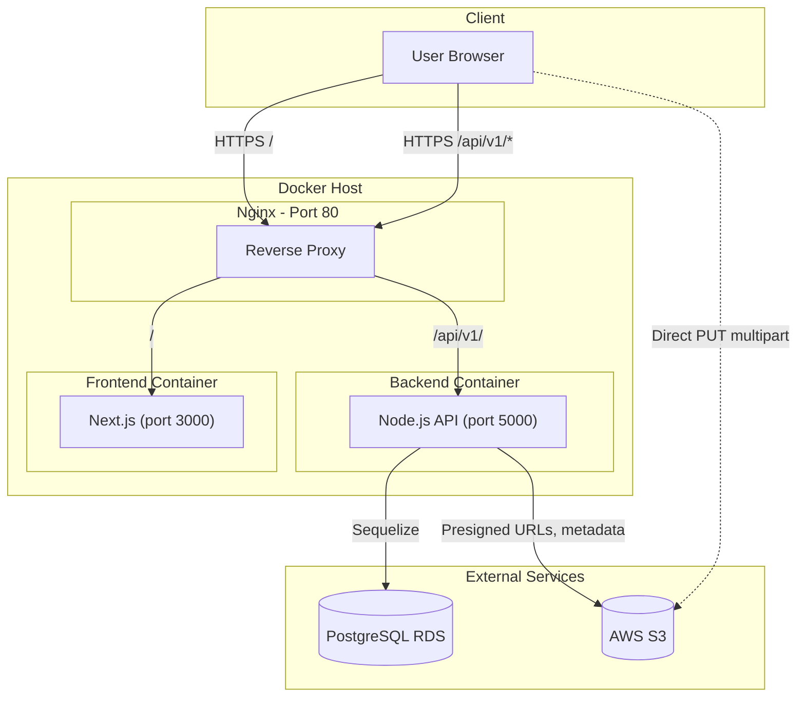

# Hệ thống học tập trực tuyến OPENBK

Chào mừng bạn đến với **Hệ thống học tập trực tuyến OPENBK**. Đây là một nền tảng học trực tuyến được xây dựng nhằm cung cấp các khóa học đa dạng và môi trường học tập tương tác.

Ứng dụng đã được triển khai tại: [openbk.me](openbk.me)

---

## Kiến trúc hệ thống



**Luồng chính:**
- **User** truy cập `openbk.me` → **Nginx** nhận request, route `/` sang Frontend, `/api/v1/` sang Backend
- **Backend** kết nối **PostgreSQL** (RDS) cho dữ liệu, **S3** cho file video
- **Upload video lớn**: Client nhận presigned URL từ Backend, upload trực tiếp lên S3 (không qua Backend)

---

Link repo front-end & backend:
* [https://github.com/layducky/Open_BK_FE](https://github.com/layducky/Open_BK_FE)
* [https://github.com/layducky/Open_BK_BE](https://github.com/layducky/Open_BK_BE)

---
## Chức năng của hệ thống

### 1. **Tạo tài khoản và đăng nhập**

* Người dùng có thể đăng ký tài khoản mới và đăng nhập vào hệ thống.
* Đăng nhập sử dụng **JWT** (JSON Web Tokens) và **Cookies** để xác thực và duy trì phiên làm việc.

### 2. **Guest User**

* Người dùng không đăng nhập (guest) có thể xem thông tin chi tiết của các khóa học có sẵn.
* Guest không thể tham gia khóa học hoặc thực hiện các hành động quản lý.

### 3. **Learner Role (Học viên)**

* Tham gia các khóa học có sẵn.
* Xem bài kiểm tra của khóa học.
* Quản lý các khóa học đã đăng ký, theo dõi tiến độ học tập.

### 4. **Collaborator Role (Giảng viên)**

* Tạo khóa học mới với các **đơn vị học (unit)**.
* Mỗi unit có thể chứa các câu hỏi (question) cho bài kiểm tra.
* Quản lý và chỉnh sửa nội dung các khóa học đã tạo.

---

## Công nghệ sử dụng

* **Frontend**: [Next.js](https://github.com/layducky/Open_BK_FE)
* **Backend**: [Node.js](https://github.com/layducky/Open_BK_BE)
* **Database**: PostgreSQL
* **Authentication**: JWT + Cookies
* **Triển khai**: Docker + Docker Compose + Nginx + Certbot (SSL)

---

## Cách chạy dự án

### 1. Clone dự án

Clone cả **frontend**, **backend** và repo cấu hình Docker:

```bash
git clone https://github.com/layducky/Open_BK_FE
git clone https://github.com/layducky/Open_BK_BE
```

### 2. Tạo file .env .env.be và .env.fe trong thư mục Devops_OpenBK
Cấu trúc gồm:
* .env:
```bash
DB_USER=<...>
DB_PASS=<...>
DB_NAME=<...>
DB_PORT=<...>
# Cần thêm các biến sau khi build frontend từ source (docker compose up --build)
NEXT_PUBLIC_API_URL=http://<ip>:<port>/api/v1
NEXT_PUBLIC_GOOGLE_CLIENT_ID=<...>
NEXT_PUBLIC_GOOGLE_CLIENT_SECRET=<...>
```
* .env.be:
```bash
PORT = <...>
ACCESS_TOKEN_SECRET = '11111'
ACCESS_TOKEN_LIFETIME = '1d'
DB_DIALECT = 'postgres'
DB_URL='postgres://postgres:<dbpassword>@<db_hostname>:<port>/opbk'
FE_ORIGIN = <frontend_origin>
# S3 (cho upload video trực tiếp từ client)
AWS_ACCESS_KEY_ID = <...>
AWS_SECRET_ACCESS_KEY = <...>
AWS_REGION = ap-southeast-1
S3_BUCKET_NAME = <bucket_name>
```

* .env.fe:
```bash
NEXT_PUBLIC_API_URL=https://<domain>/api/v1
NEXT_PUBLIC_GOOGLE_CLIENT_ID=<...>
NEXT_PUBLIC_GOOGLE_CLIENT_SECRET=<...>
NEXTAUTH_SECRET=<...>
NEXTAUTH_URL=https://<domain>
```
> **Lưu ý:** `NEXTAUTH_URL` phải trùng domain production (vd: `https://openbk.me`) để tránh redirect về localhost sau khi login.

### 3. Chạy dự án

**Cách 1 - Dùng image có sẵn từ Docker Hub** (khuyến nghị cho production):
```bash
docker compose pull
docker compose up -d
```

**Cách 2 - Build frontend từ source** (khi cần tùy chỉnh API URL):
Đảm bảo đã clone Open_BK_FE vào thư mục cùng cấp với Devops_OpenBK, và thêm `NEXT_PUBLIC_API_URL`, `NEXT_PUBLIC_GOOGLE_CLIENT_ID`, `NEXT_PUBLIC_GOOGLE_CLIENT_SECRET` vào file `.env`:
```bash
docker compose up -d --build
```

Sau khi khởi chạy thành công:

* Ứng dụng : [openbk.me](openbk.me)

---

## S3 CORS - Upload video trực tiếp từ client

Để upload video lớn qua multipart (client → S3 trực tiếp), cần cấu hình CORS trên bucket S3:

1. Vào AWS Console → S3 → chọn bucket → Permissions → CORS
2. Dán nội dung từ file `s3-cors-config.json` hoặc cấu hình tương đương:

```json
[
  {
    "AllowedOrigins": ["https://openbk.me", "https://www.openbk.me", "http://localhost:3000"],
    "AllowedMethods": ["PUT"],
    "AllowedHeaders": ["*"],
    "ExposeHeaders": ["ETag"]
  }
]
```

---

## CI/CD - Build image Frontend (Open_BK_FE)

Khi push tag `v*.*.*` lên repo Open_BK_FE, GitHub Actions sẽ build và push image lên Docker Hub. Cần cấu hình các **Secrets** sau trong repo Open_BK_FE (Settings > Secrets and variables > Actions):

| Secret | Mô tả |
|--------|-------|
| `DOCKER_USERNAME` | Tên đăng nhập Docker Hub |
| `DOCKER_PASSWORD` | Mật khẩu/token Docker Hub |
| `NEXT_PUBLIC_API_URL` | URL API production (vd: `https://openbk.me/api/v1`) |
| `NEXT_PUBLIC_GOOGLE_CLIENT_ID` | Google OAuth Client ID |
| `NEXT_PUBLIC_GOOGLE_CLIENT_SECRET` | Google OAuth Client Secret |

---

## Load Test với K6 - Kiểm tra sức chịu tải

Sử dụng [k6](https://k6.io/) để test trang web chịu tải tối đa bao nhiêu người dùng.

### Bước 1: Cài đặt K6

**Windows (chocolatey):**
```bash
choco install k6
```

**Windows (winget):**
```bash
winget install k6 --source winget
```

**macOS:**
```bash
brew install k6
```

**Linux:**
```bash
sudo gpg -k
sudo gpg --no-default-keyring --keyring /usr/share/keyrings/k6-archive-keyring.gpg --keyserver hkp://keyserver.ubuntu.com:80 --recv-keys C5AD17C747E3415A3642D57D77C6C491D6AC1D69
echo "deb [signed-by=/usr/share/keyrings/k6-archive-keyring.gpg] https://dl.k6.io/deb stable main" | sudo tee /etc/apt/sources.list.d/k6.list
sudo apt-get update
sudo apt-get install k6
```

### Bước 2: Chạy Load Test cơ bản

```bash
cd Devops_OpenBK
k6 run load-test.js
```

Script này sẽ:
- Tăng dần từ 0 → 50 virtual users (VU) trong 2 phút
- Giữ 50 VU thêm 2 phút
- Gọi trang chủ, API danh sách khóa học, API danh mục
- In báo cáo thống kê cuối cùng

### Bước 3: Chạy Stress Test (tìm ngưỡng tối đa)

```bash
k6 run load-test-stress.js
```

Script tăng dần: 10 → 30 → 50 → 100 → 150 → 200 → 250 → 300 VU. Quan sát khi **http_req_failed** tăng hoặc **http_req_duration** tăng mạnh → đó là ngưỡng chịu tải gần đúng.

### Bước 4: Test với URL khác (localhost, staging)

```bash
k6 run -e BASE_URL=http://localhost load-test.js
```

hoặc:

```bash
k6 run -e BASE_URL=https://openbk.me load-test.js
```

### Kết quả mẫu

Sau khi chạy, k6 in ra:
- **http_reqs**: Số request thành công
- **http_req_failed**: Tỷ lệ request lỗi (càng thấp càng tốt)
- **http_req_duration**: Thời gian phản hồi (avg, p95, p99)
- **vus**: Số virtual users đồng thời

Khi tỷ lệ lỗi tăng trên 5% hoặc thời gian phản hồi tăng đột biến → hệ thống đã vượt ngưỡng chịu tải.

---

